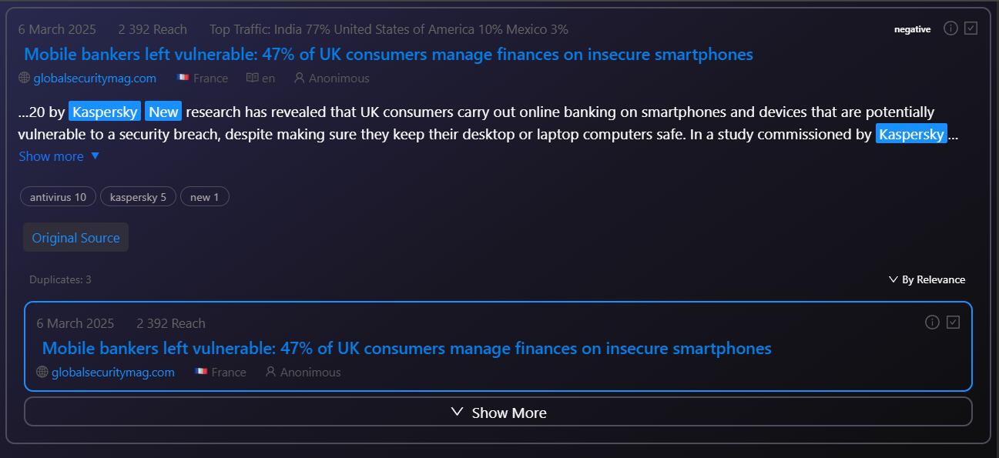

🚀 **kaspTest - React Component Implementation**

---

---

## 📖 Описание

Реализация компонента на основе макета от дизайнера в рамках тестового задания. Проект разработан с использованием современного стека технологий и архитектуры **Feature-Sliced Design (FSD)**. Включает имитацию REST API для тестирования функциональности.

---

## 🌟 Особенности

- **Компонентный подход**: Четкое разделение на переиспользуемые UI-компоненты.
- **Pixel Perfect** (почти 😊): Соответствие стилей предоставленному макету.
- **Mock API**: Имитация бэкенда с помощью моковых данных.
- **Архитектура FSD**: Логическая структура проекта согласно Feature-Sliced Design.
- **Интеграция Ant Design**: Использование готовых компонентов библиотеки для ускорения разработки.

---

## 🛠 Стек технологий

- **React** + **TypeScript**  
- **Redux Toolkit** для управления состоянием  
- **SCSS** для стилизации  
- **Ant Design** как UI-библиотека  
- **Vite** 
- **ESLint** + **Prettier** для линтинга

---
